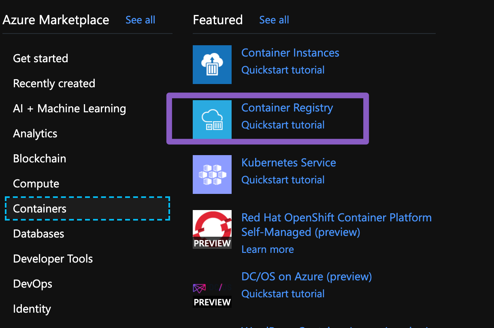
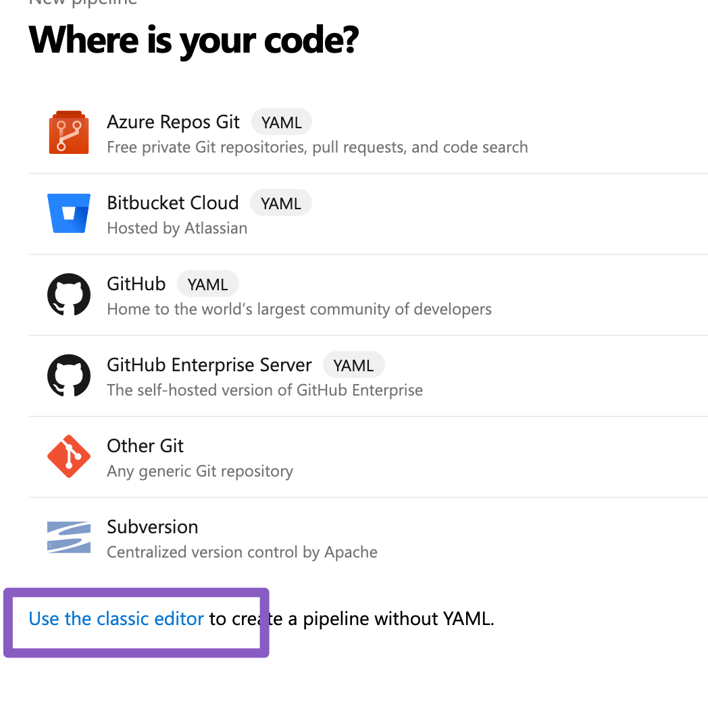
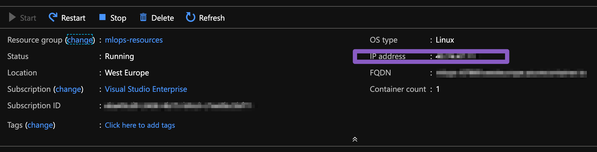

Hands-on: Deploying a self contained model
============================================

Let's get started with some practical exercises.

Start by cloning the tutorial repo 👉🏼 `https://github.com/trallard/ml_devops_tutorial <https://github.com/trallard/ml_devops_tutorial>`_ 

Predicting Titanic survival
""""""""""""""""""""""""""""""

We are going to use the popular Titanic dataset to generate a predictive model.
The goal is to predict whether someone would have survived in the Titanic based on features such as age,
class on the sip, sex, and fare.

Said model will be then exposed as a REST API using Flask.

You can find the code for the app in ``hands-on/web app``

You will notice from the directory that you have an ``app.py`` file. This is 
where we create the app and expose the model as a REST API.

You can run the app from your terminal like so:
::
    cd hands-on/web app
    flask run

Once the app is running you will be able to access it on `http://localhost:5000 <http://localhost:5000>`_
Then access the multiple endpoints using curl or Postman. For example
::
    curl -X GET http://localhost:5000  # should return the index
    curl -X GET http://localhost:5000/train # will train the model 
    curl -X GET http://localhost:5000/wipe  # will delete the model
    curl -d '[
    {"Age": 85, "Sex": "male", "Embarked": "S"},
    {"Age": 24, "Sex": "female", "Embarked": "C"},
    {"Age": 3, "Sex": "male", "Embarked": "C"},
    {"Age": 21, "Sex": "male", "Embarked": "S"}
    ]' -H "Content-Type: application/json" \
        -X POST http://localhost:5000/predict && \
        echo -e "\n -> predict OK"

Once you have finished you can stop the app with ``Ctrl + C``.

Deploying your app
--------------------

The next step will be to deploy the app. To do so we are going to use `Azure DevOps <https://azure.microsoft.com/services/devops/?WT.mc_id=mlops-github-taallard>`_

.. image:: ./_static/assets/mlops.png
 

🚦Let's make sure you have access to Azure DevOps and other tools.

☁️ We are going to deploy the app within Docker containers and using AzureDevOps.

First we need to create a container registry for your containers.

1. Go to your Azure dashboard and click on + Create a resource
2. Choose container registry
3. Fill in the details. Note that you need a unique registry name (but something you can remember)

Setting your DevOps pipeline 
"""""""""""""""""""""""""""""""

1. Log in to `AzureDevOps <https://azure.microsoft.com/services/devops/?WT.mc_id=mlops-github-taallard>`_ 
2. Go to Pipelines > New Pipelines 
3. Select use the classic editor

4. Complete the details with your repo. Note that you might be asked to log in with GitHub for this.
You might be redirected to GitHub to install the Azure Pipelines app. If so, select Approve and install.
5. Select the Docker runner
6. Complete the details of the form. Here you can choose if using a private Azure container registry or DockerHub
7. Save and run

As soon as the pipeline completes you can see the image being pushed to the registry.

Since we are building the image from the Repo and within pipelines we can then use this as an artefact for the next part: the release.

🚧🚧 Next we need to create the release pipeline
""""""""""""""""""""""""""""""""""""""""""""""""""""

1. Click on Releases + create a release pipeline
2. Give the step a sensible name
3. Add an artifact > We are going to use the previous build

.. image:: https://metavrse.files.wordpress.com/2018/10/add-a-container-image-type-artifact.png

4. We now need to add a task. Since we are deploying to the container instance we need to start an Azure CLI
5. Change the script to inline and add the code below
::
    az container create --resource-group <your group> --name <containername> --image <image name>:latest --ports 9999 --dns-name-label <mlops-67869>

Note that the dns label needs to be unique.

6. Save and make a release

Once completed go to your dashboard > container instances and click on the newly created instance and copy the ip address

Now you can access the model using curl, httpie or postman:
::
    http 40.74.47.11:9999/train
    HTTP/1.0 200 OK
    Content-Length: 93
    Content-Type: text/html; charset=utf-8
    Date: Sun, 16 Jun 2019 01:23:21 GMT
    Server: Werkzeug/0.15.4 Python/3.7.3

    Success.
    Trained in 0.017420530319213867 seconds.
    Model training score: 0.8361391694725028.